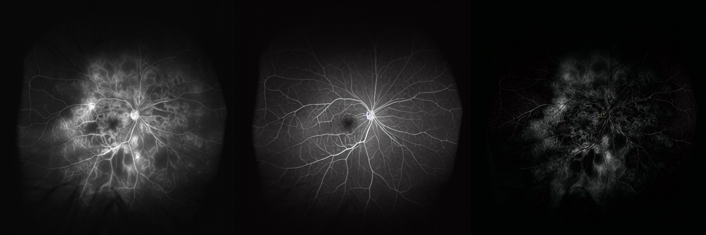

# Controllable UWFA Editing

This is the repository for "Controllable editing via diffusion inversion on ultra-widefield fluorescein angiography for the comprehensive analysis of diabetic retinopathy".

## CLIP Tuning
In the training stage, the CLIP is tuned by prompt tuning strategy using infoNCE loss.
```
sh scripts/train_clip.sh
```

## Stable Diffusion Tuning
In the training stage, the SD model is trained with the multimodal embeddings.
```
sh scripts/multi_lora.sh
```

## Controllable Editing
During the inferencing phase, the original UWFA image is edited into disease-free domain.
```
sh scripts/inference_inversion.sh
```


## Citing
If this project is help for you, please cite it.
```
@article{ma2024controllable,
  title={Controllable editing via diffusion inversion on ultra-widefield fluorescein angiography for the comprehensive analysis of diabetic retinopathy},
  author={Ma, Xiao and Ji, Zexuan and Chen, Qiang and Ge, Lexin and Wang, Xiaoling and Chen, Changzheng and Fan, Wen},
  journal={Biomedical Optics Express},
  volume={15},
  number={3},
  pages={1831--1846},
  year={2024},
  publisher={Optica Publishing Group}
}
```
